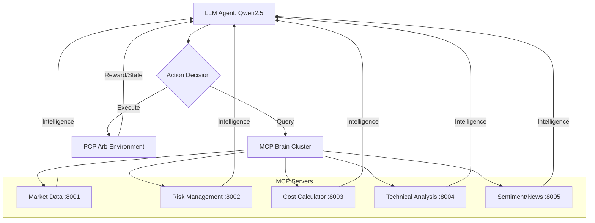

# 📈 PCP Arbitrage RL Agent — OpenEnv Hackathon 2026

## 🎯 Problem Statement
Put-Call Parity (PCP) violations in the NSE Indian options markets often appear as "free money" on paper. However, the reality of the Indian market is complex. Most of these opportunities are **unprofitable** after accounting for:
- **STT (Securities Transaction Tax)**: Especially the 0.125% "STT Trap" on intrinsic value for ITM options on expiry.
- **Brokerage & GST**: Fixed and variable transaction costs.
- **Slippage**: Impact of market liquidity.

We built an RL agent that doesn't just look at price—it learns to detect **real** arbitrage opportunities by accounting for the full cost of execution.

## 🏗️ Architecture
The system is built on the **OpenEnv** framework, featuring an active-intelligence loop where the agent queries specialized servers before making decisions.

- **LLM Agent**: Qwen2.5-1.5B (4-bit quantized for efficiency)
- **Training**: GRPO (Group Relative Policy Optimization) via **Unsloth**
- **Framework**: OpenEnv compliant environment
- **Intelligence Layer**: 5 MCP Brain Servers

## 📊 Training Results
Our agent demonstrated consistent improvement as it navigated the complexities of transaction costs.

| Step | Reward | Status |
|:---|:---|:---|
| Step 0 | -0.38 | Baseline (Random/Erroneous) |
| Step 9 | -0.17 | Learning begins (Format compliance) |
| Step 20 | +0.05 | Turned positive (Profitability found) |
| Step 52 | +0.05 | Stable (MODERATE stage reached) |

## 🏆 Training Ground Results
Comparison of performance across different domains.

| Round | Environment | Initial Score | Final Score |
|:---|:---|:---|:---|
| R1 | Customer Support Triage | 0.71 | 0.86 |
| R2 | PCP Arbitrage | -0.38 | +0.05 |

## 🪜 Curriculum Stages
The agent was trained through a 4-stage curriculum to build robust decision-making.

| Stage | Violation Range | Key Learning Objective |
|:---|:---|:---|
| **OBVIOUS** | > 1.0% | Basic entry/exit mechanics |
| **MODERATE** | 0.5% - 1.0% | Active usage of cost/risk tools |
| **REALISTIC** | 0.3% - 0.8% | STT trap avoidance & margin safety |
| **LIVE_SIM** | 0.1% - 0.5% | Production readiness & slippage handling |

## ⚖️ Reward Components
The reward function is multi-faceted to ensure the agent behaves like a professional trader.

| Component | Weight | Objective |
|:---|:---|:---|
| **Profitability** | 35% | Net P&L after all Indian taxes/costs |
| **Timing** | 25% | Optimal entry and exit speed |
| **Cost Awareness** | 25% | Proactive tool calls to MCP Cost Server |
| **Format Compliance** | 15% | Strict adherence to JSON action schemas |

## 💡 Key Innovation: Active Intelligence
Unlike traditional RL agents that passively receive a flat observation vector, this agent **ACTIVELY** calls MCP tool servers before every trade decision. 

It checks the **Cost Server** to calculate if a 0.7% violation is actually a loss due to STT, and queries the **Risk Server** for current exposure. The notorious **STT Trap** (0.125% of intrinsic value on expiry) is modeled precisely, teaching the agent to avoid ITM settlements that would wipe out arbitrage gains.

## 🔗 Project Links
- 🏢 **R1 Environment**: [support-triage-openenv](https://github.com/aganirudh/support-triage-openenv)
- 📈 **R2 Environment**: [fno-price-predictor](https://github.com/Sriya-Rani-Khadanga/fno-price-predictor)
- 🏋️ **Training Ground**: [training_ground](https://github.com/Sriya-Rani-Khadanga/training_ground)
- 🧪 **WandB Metrics**: [View Training Logs](https://wandb.ai/khadangasriya4-ramaiah-institute-of-technology/pcp-arb-rl)

---
Built at **OpenEnv Hackathon 2026** 🔥
